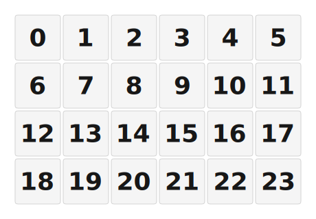

# ZMK Configuration for m4x6

*Generated by Shield Wizard for ZMK*



Download compiled firmware from the Actions tab. <https://zmk.dev/docs/user-setup#installing-the-firmware>

Edit your keymap <https://zmk.dev/docs/keymaps>.
User keymap is located at [`config/m4x6.keymap`](config/m4x6.keymap).

-----

<details>
<summary>
Shield Wizard Debug Information
</summary>

In case of broken configuration, here is the Shield Wizard internal data used to generate this configuration:

Commit: 63ab9b7bd8845252979f45da72f40210b0b1a3ae

```json
{"name":"m4x6","shield":"m4x6","dongle":false,"modules":[],"layout":[{"id":"01KVG5K0XQ9DKN4XZY5GV07R4D","part":0,"row":0,"col":0,"w":1,"h":1,"x":0,"y":0,"r":0,"rx":0,"ry":0},{"id":"01KVG5K0XQWPZF8P5DKYNPN1BP","part":0,"row":0,"col":1,"w":1,"h":1,"x":1,"y":0,"r":0,"rx":0,"ry":0},{"id":"01KVG5K0XQYRY43VJ025V99CKA","part":0,"row":0,"col":2,"w":1,"h":1,"x":2,"y":0,"r":0,"rx":0,"ry":0},{"id":"01KVG5K0XQ89BPQZGZJZS14MT3","part":0,"row":0,"col":3,"w":1,"h":1,"x":3,"y":0,"r":0,"rx":0,"ry":0},{"id":"01KVG5K0XQSX300QQGBNFNY8KH","part":0,"row":0,"col":4,"w":1,"h":1,"x":4,"y":0,"r":0,"rx":0,"ry":0},{"id":"01KVG5K0XQ7HJRMSSYCFHFYHB5","part":0,"row":0,"col":5,"w":1,"h":1,"x":5,"y":0,"r":0,"rx":0,"ry":0},{"id":"01KVG5K0XQCBRRAA246DYHQPDX","part":0,"row":1,"col":0,"w":1,"h":1,"x":0,"y":1,"r":0,"rx":0,"ry":0},{"id":"01KVG5K0XQGDSC1NM3RWN7A88B","part":0,"row":1,"col":1,"w":1,"h":1,"x":1,"y":1,"r":0,"rx":0,"ry":0},{"id":"01KVG5K0XQFMZVDJXVGVT6V3DF","part":0,"row":1,"col":2,"w":1,"h":1,"x":2,"y":1,"r":0,"rx":0,"ry":0},{"id":"01KVG5K0XQ868299C2V0RA166T","part":0,"row":1,"col":3,"w":1,"h":1,"x":3,"y":1,"r":0,"rx":0,"ry":0},{"id":"01KVG5K0XRJMM8W3RNWX5P2QVZ","part":0,"row":1,"col":4,"w":1,"h":1,"x":4,"y":1,"r":0,"rx":0,"ry":0},{"id":"01KVG5K0XRGG7EBBKGEHA6DHZS","part":0,"row":1,"col":5,"w":1,"h":1,"x":5,"y":1,"r":0,"rx":0,"ry":0},{"id":"01KVG5K0XRZMT7SD45Y8XYQTE0","part":0,"row":2,"col":0,"w":1,"h":1,"x":0,"y":2,"r":0,"rx":0,"ry":0},{"id":"01KVG5K0XRW3Z0RBP46ZHETTDK","part":0,"row":2,"col":1,"w":1,"h":1,"x":1,"y":2,"r":0,"rx":0,"ry":0},{"id":"01KVG5K0XR1FDYA59HS7S6WQ57","part":0,"row":2,"col":2,"w":1,"h":1,"x":2,"y":2,"r":0,"rx":0,"ry":0},{"id":"01KVG5K0XR0FNMC0EHT7AJ27MN","part":0,"row":2,"col":3,"w":1,"h":1,"x":3,"y":2,"r":0,"rx":0,"ry":0},{"id":"01KVG5K0XR0PQZ2PFKTSDY288R","part":0,"row":2,"col":4,"w":1,"h":1,"x":4,"y":2,"r":0,"rx":0,"ry":0},{"id":"01KVG5K0XRBFA6ZCVZEEPTMK8D","part":0,"row":2,"col":5,"w":1,"h":1,"x":5,"y":2,"r":0,"rx":0,"ry":0},{"id":"01KVG5K0XRR34Q5P53TNYWYGVB","part":0,"row":3,"col":0,"w":1,"h":1,"x":0,"y":3,"r":0,"rx":0,"ry":0},{"id":"01KVG5K0XRRV4QY4X9F7EA7DRB","part":0,"row":3,"col":1,"w":1,"h":1,"x":1,"y":3,"r":0,"rx":0,"ry":0},{"id":"01KVG5K0XR01DJRCVADM52TZAB","part":0,"row":3,"col":2,"w":1,"h":1,"x":2,"y":3,"r":0,"rx":0,"ry":0},{"id":"01KVG5K0XRCR37ZY41K2MYZT9B","part":0,"row":3,"col":3,"w":1,"h":1,"x":3,"y":3,"r":0,"rx":0,"ry":0},{"id":"01KVG5K0XR8454A9CE4TWMR8MY","part":0,"row":3,"col":4,"w":1,"h":1,"x":4,"y":3,"r":0,"rx":0,"ry":0},{"id":"01KVG5K0XRWZGG6PJ7GDP3Q2B9","part":0,"row":3,"col":5,"w":1,"h":1,"x":5,"y":3,"r":0,"rx":0,"ry":0}],"parts":[{"name":"unibody","controller":"nice_nano_v2","wiring":"matrix_diode","pins":{"d15":"input","d14":"input","d16":"input","d10":"input","d9":"output","d8":"output","d7":"output","d6":"output","d19":"output","d18":"output"},"keys":{"01KVG5K0XQ9DKN4XZY5GV07R4D":{"input":"d15","output":"d9"},"01KVG5K0XQWPZF8P5DKYNPN1BP":{"input":"d15","output":"d8"},"01KVG5K0XQYRY43VJ025V99CKA":{"input":"d15","output":"d7"},"01KVG5K0XQ89BPQZGZJZS14MT3":{"input":"d15","output":"d6"},"01KVG5K0XQSX300QQGBNFNY8KH":{"input":"d15","output":"d19"},"01KVG5K0XQ7HJRMSSYCFHFYHB5":{"input":"d15","output":"d18"},"01KVG5K0XQCBRRAA246DYHQPDX":{"input":"d14","output":"d9"},"01KVG5K0XQGDSC1NM3RWN7A88B":{"input":"d14","output":"d8"},"01KVG5K0XQFMZVDJXVGVT6V3DF":{"input":"d14","output":"d7"},"01KVG5K0XQ868299C2V0RA166T":{"input":"d14","output":"d6"},"01KVG5K0XRJMM8W3RNWX5P2QVZ":{"input":"d14","output":"d19"},"01KVG5K0XRGG7EBBKGEHA6DHZS":{"input":"d14","output":"d18"},"01KVG5K0XRZMT7SD45Y8XYQTE0":{"input":"d16","output":"d9"},"01KVG5K0XRW3Z0RBP46ZHETTDK":{"input":"d16","output":"d8"},"01KVG5K0XR1FDYA59HS7S6WQ57":{"input":"d16","output":"d7"},"01KVG5K0XR0FNMC0EHT7AJ27MN":{"input":"d16","output":"d6"},"01KVG5K0XR0PQZ2PFKTSDY288R":{"input":"d16","output":"d19"},"01KVG5K0XRBFA6ZCVZEEPTMK8D":{"input":"d16","output":"d18"},"01KVG5K0XRR34Q5P53TNYWYGVB":{"input":"d10","output":"d9"},"01KVG5K0XRRV4QY4X9F7EA7DRB":{"input":"d10","output":"d8"},"01KVG5K0XR01DJRCVADM52TZAB":{"input":"d10","output":"d7"},"01KVG5K0XRCR37ZY41K2MYZT9B":{"input":"d10","output":"d6"},"01KVG5K0XR8454A9CE4TWMR8MY":{"input":"d10","output":"d19"},"01KVG5K0XRWZGG6PJ7GDP3Q2B9":{"input":"d10","output":"d18"}},"encoders":[],"buses":[{"name":"spi0","devices":[],"type":"spi"},{"name":"spi1","devices":[],"type":"spi"},{"name":"spi2","devices":[],"type":"spi"},{"name":"spi3","devices":[],"type":"spi"},{"name":"i2c0","devices":[],"type":"i2c"},{"name":"i2c1","devices":[],"type":"i2c"}]}]}
```

</details>
